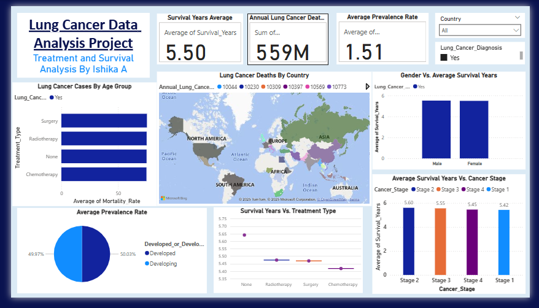

# **Lung Cancer Data Analysis Project**  
<picture></picture>
<picture></picture>

## Tools :

MySQL, MS Excel, Google Sheets, MS Power BI, Github

## Skills :

Data Extraction, Data Transfer, Data Loading, Data Analysis, Data Cleansing, Data Manipulation, Data Visualization

## Dataset Size :

- 2,20,633 Rows  
- 24 Columns
  
### About the Dataset :

The Lung Cancer Prediction Dataset contains patient records that help analyze risk factors associated with lung cancer. It includes demographic details such as age, gender, country, and medical and lifestyle factors like smoking habits, passive smoking exposure, and air pollution levels. The dataset also provides genetic risk levels, lung cancer diagnosis status, cancer stage, and treatment types, making it useful for predictive modeling and healthcare analytics. Additionally, it includes computed risk scores, survival years, and mortality rates, which can be used to assess the impact of different factors on patient outcomes. The dataset is valuable for identifying high-risk individuals, studying smoking-related lung cancer trends, and developing early detection strategies. Researchers and data analysts can leverage this dataset to build machine-learning models for cancer prediction, survival analysis, and personalized treatment recommendations.

## Problem Statement : (Please refer to analysis.md for solutions)

### Basic Level

1. Retrieve all records for individuals diagnosed with lung cancer.  
2. Count the number of smokers and non-smokers.  
3. List all unique cancer stages present in the dataset.  
4. Retrieve the average number of cigarettes smoked per day by smokers.  
5. Count the number of people exposed to high air pollution.  
6. Find the top 5 countries with the highest lung cancer deaths.  
7. Count the number of people diagnosed with lung cancer by gender.  
8. Retrieve records of individuals older than 60 who are diagnosed with lung cancer.

### Intermediate Level

9. Find the percentage of smokers who developed lung cancer.
10. Calculate the average survival years based on cancer stages.
11. Count the number of lung cancer patients based on passive smoking.
12. Find the country with the highest lung cancer prevalence rate.
13. Identify the smoking years' impact on lung cancer.
14. Determine the mortality rate for patients with and without early detection.
15. Group the lung cancer prevalence rate by developed vs. developing countries.

### Advanced Level

16. Identify the relation between lung cancer prevalence and air pollution levels.
17. Find the average age of lung cancer patients for each country.
18. Calculate the risk factor of lung cancer by smoker status, passive smoking, and family history.
19. Rank countries based on their mortality rate.
20. Determine if treatment type has a significant impact on survival years.
21. Compare lung cancer prevalence in men vs. women across countries.
22. Find how occupational exposure, smoking, and air pollution collectively impact lung cancer rates.

## 📩 Contact :
📧 Email: ishika.agrawal0105@gmail.com    
💼 LinkedIn: https://www.linkedin.com/in/ishikaagrawal88  
📜 License : This project is licensed under the MIT License.
