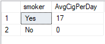
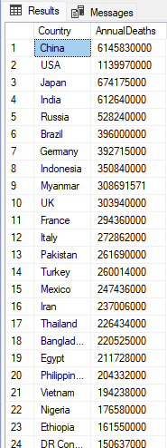
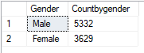
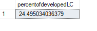
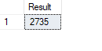
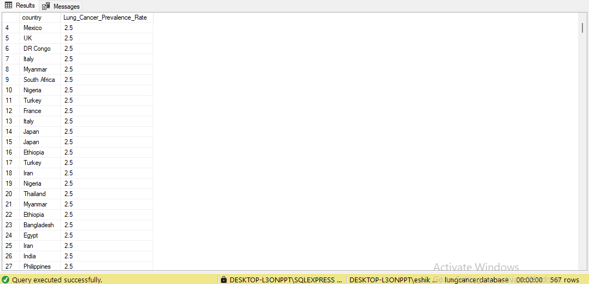
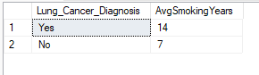
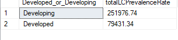
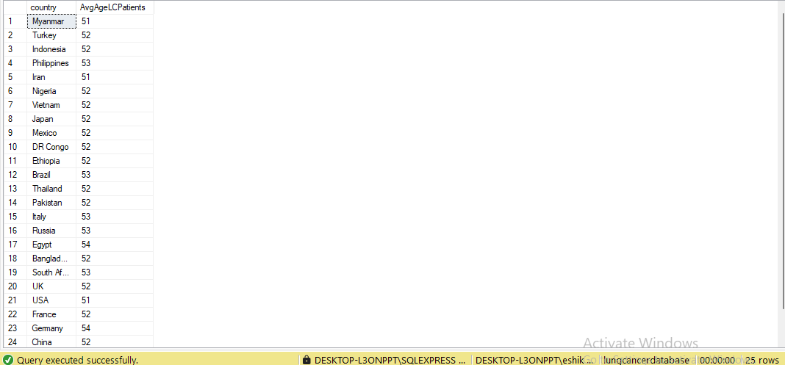
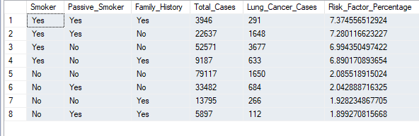

## Step 1. Data Cleaning
  - Duplicate Data : None
  - Missing Data : Yes, in 2 columns cancer_stage and treatment_type,  
    handled with none as a value by choosing not null constraint in sql table  
<picture></picture>
    
## Step 2. Create SQL Database Table
 - Tool : Microsoft SQL Management Studio Version 20.2
 - Language : T-SQL
 - Rows : 220632
 - Columns : 24
 - Query to create table :  
   CREATE TABLE lung_cancer_data (
    ID INT PRIMARY KEY,
    Country VARCHAR(255),
    Population_Size INT,
    Age INT,
    Gender VARCHAR(10),
    Smoker VARCHAR(3),
    Years_of_Smoking INT,
    Cigarettes_per_Day INT,
    Passive_Smoker VARCHAR(3),
    Family_History VARCHAR(3),
    Lung_Cancer_Diagnosis VARCHAR(3),
    Cancer_Stage VARCHAR(50),
    Survival_Years INT,
    Adenocarcinoma_Type VARCHAR(50),
    Air_Pollution_Exposure VARCHAR(10),
    Occupational_Exposure VARCHAR(3),
    Indoor_Pollution VARCHAR(3),
    Healthcare_Access VARCHAR(50),
    Early_Detection VARCHAR(3),
    Treatment_Type VARCHAR(50),
    Developed_or_Developing VARCHAR(50),
    Annual_Lung_Cancer_Deaths INT,
    Lung_Cancer_Prevalence_Rate FLOAT,
    Mortality_Rate FLOAT
);

## Step 3. Ask Questions  
*1. Retrieve all records for individuals diagnosed with lung cancer.* 

select * from lungcancertable where Lung_Cancer_Diagnosis='Yes';
<picture>

</picture>  

*2. Count the number of smokers and non-smokers.*  

select Smoker, count(smoker) as Smokers_count from lungcancertable group by smoker;

<picture>

</picture>  

*3. List all unique cancer stages present in the dataset.*  

select count(cancer_stage) as count, cancer_stage from lungcancertable group by Cancer_Stage  
order by Cancer_Stage;

<picture>

</picture>  

*4. Retrieve the average number of cigarettes smoked per day by smokers.*  

select smoker, AVG(cigarettes_per_day) as AvgCigPerDay from lungcancertable group by smoker;

<picture>

</picture>  

*5. Count the number of people exposed to high air pollution.*  

select sum(case when air_pollution_exposure = 'high' then 1 else 0 end) as HighAirPolCount  
from lungcancertable;

<picture>

</picture>  

*6. Find the top 5 countries with the highest lung cancer deaths.*  

SELECT Country, SUM(CAST(Annual_Lung_Cancer_Deaths AS BIGINT)) AS AnnualDeaths  
FROM lungcancertable  
GROUP BY Country ORDER BY annualdeaths DESC;

<picture>

</picture>

<picture>

</picture>  

*7. Count the number of people diagnosed with lung cancer by gender.*  

select Gender, sum(case when lung_cancer_diagnosis = 'Yes' then 1 else 0 end)  
as Countbygender from lungcancertable group by Gender

<picture>

</picture>  

*8. Retrieve records of individuals older than 60 who are diagnosed with lung cancer.*  

select * from lungcancertable where age>60 and Lung_Cancer_Diagnosis = 'Yes';

<picture>

</picture>

<picture>

</picture>  

*9. Find the percentage of smokers who developed lung cancer.*  

select 
sum(case when lung_cancer_diagnosis = 'Yes' and Developed_or_developing = 'Developed'  
then 1 else 0 end)*100.0/  
sum(case when lung_cancer_diagnosis = 'Yes' then 1 else 0 end) as percentofdevelopedLC  
from lungcancertable

<picture>

</picture>  

*10. Calculate the average survival years based on cancer stages.*  

select cancer_stage, avg(survival_years) as AvgSurvivalYears  
from lungcancertable group by cancer_stage order by cancer_stage;

<picture>

</picture>  

*11. Count the number of lung cancer patients based on passive smoking.*  

select sum(case when lung_cancer_diagnosis = 'Yes' and passive_smoker = 'Yes'  
then 1 else 0 end) as Result from lungcancertable  

<picture>

</picture>

*12. Find the country with the highest lung cancer prevalence rate.* 

SELECT country, Lung_Cancer_Prevalence_Rate FROM lungcancertable  
WHERE Lung_Cancer_Prevalence_Rate =  
(SELECT MAX(Lung_Cancer_Prevalence_Rate) FROM lungcancertable);  

<picture>

</picture>

*Identify the smoking years' impact on lung cancer.*

select Lung_Cancer_Diagnosis, Avg(Years_of_Smoking) as AvgSmokingYears from lungcancertable  
Group by Lung_Cancer_Diagnosis;

<picture>

</picture>  

*14. Determine the mortality rate for patients with and without early detection.*  

SELECT Early_Detection,  
    SUM(CASE WHEN Early_Detection = 'Yes' THEN Mortality_Rate ELSE 0 END) * 1.0 / SUM(Mortality_Rate)  
	AS MortalityRate FROM lungcancertable GROUP BY Early_Detection;  

<picture>

</picture>

*15. Group the lung cancer prevalence rate by developed vs. developing.*  

select Developed_or_Developing, round(sum(lung_cancer_prevalence_rate),2) as totalLCPrevalenceRate  
from lungcancertable Group by Developed_or_Developing;  

<picture>

</picture>

*17. Find the average age of lung cancer patients for each country.*  

select country, AVG(age) as AvgAgeLCPatients from lungcancertable  
where Lung_Cancer_Diagnosis = 'Yes' group by country;  

<picture>

</picture>

*18. Calculate the risk factor of lung cancer by smoker status, passive smoking, and family history.*  

SELECT Smoker, Passive_Smoker, Family_History, COUNT(*) AS Total_Cases,  
SUM(CASE WHEN lung_cancer_diagnosis = 'Yes' THEN 1 ELSE 0 END) AS Lung_Cancer_Cases,  
(SUM(CASE WHEN lung_cancer_diagnosis = 'Yes' THEN 1 ELSE 0 END) * 100.0 / COUNT(*))  
AS Risk_Factor_Percentage FROM lungcancertable  
GROUP BY Smoker, Passive_Smoker, Family_History  
ORDER BY Risk_Factor_Percentage DESC;  

<picture>

</picture>

*19. Rank countries based on their mortality rate.*  

WITH CountryMortality AS (  
SELECT Country, SUM(Mortality_Rate) AS Country_Total_Mortality  
FROM lungcancertable GROUP BY Country  
),  
TotalMortality AS (  
SELECT SUM(Country_Total_Mortality) AS Total_Global_Mortality FROM CountryMortality  
)
-- Step 3: Compute the mortality rate percentage and rank countries
SELECT cm.Country, cm.Country_Total_Mortality,  
(cm.Country_Total_Mortality * 100.0 / tm.Total_Global_Mortality) AS Mortality_Percentage,  
DENSE_RANK() OVER (ORDER BY (cm.Country_Total_Mortality * 100.0 / tm.Total_Global_Mortality) DESC) AS Rank
FROM CountryMortality cm CROSS JOIN TotalMortality tm ORDER BY Rank;  

<picture>

</picture>  

<picture>

</picture>

### Analysis Based on Dashboard
**Refer To Dashboard.md**

